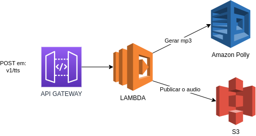
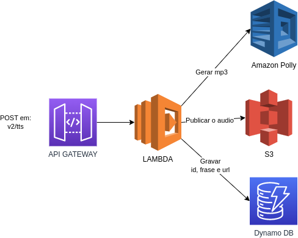
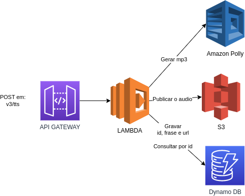
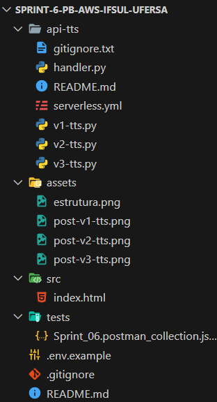

# Síntese de Fala com AWS Polly: Aplicação Serverless para Conversão de Texto em Áudio

Este projeto consiste em criar uma aplicação serverless que capture uma frase inserida pelo usuário e a transforme em um arquivo de áudio em formato MP3 utilizando o serviço Polly da AWS.

***

## Índice
- [Desenvolvimento](#desenvolvimento)
- [Dificuldades Conhecidas](#dificuldades-conhecidas)
- [Tecnologias Utilizadas](#tecnologias-utilizadas)
- [Como Utilizar o Sistema](#como-utilizar-o-sistema)
- [Estrutura de Diretórios e Arquivos](#estrutura-de-diretórios-e-arquivos)
- [Arquitetura AWS](#arquitetura-aws)
- [Integrantes](#integrantes)

***

## Desenvolvimento

O projeto foi desenvolvido com foco em Python, utilizando uma estrutura baseada em Serverless para criar uma aplicação que captura frases inseridas pelo usuário e as converte em arquivos de áudio MP3. Após construção das funções de cada uma das rotas, foi feito deploy e implementação das mesmas via Serverless Framework na plataforma da AWS, utilizando os serviços de API Gateway e Funções Lambda para funcionamento da API. Além do mencionado, foram utilizados os serviços Amazon S3 e Amazon DynamoDB para armazenamento de alguns dados para cumprir com os requisitos da aplicação.

***

## Dificuldades Conhecidas:

Familiarização com o Serverless: Esta foi nossa primeira experiência com o Serverless Framework, o que exigiu tempo para nos adaptarmos à nova abordagem de desenvolvimento e implantação de aplicações.

Problemas com o AWS Lambda: Enfrentamos alguns problemas ao tentar utilizar a biblioteca dotenv para carregar variáveis de ambiente em nossa aplicação serverless.

Problemas com URLs de Buckets: Identificamos que palavras com acentos utilizadas na geração de URLs para os Buckets do AWS S3 causavam acesso negado devido à dificuldade de tratamento adequado dos caracteres especiais no ACL (Access Control List) dos Buckets.


***
## Tecnologias utilizadas

<div style="display: inline_block">
  <table border="1">
    <tr>
        <th>Tecnologia</th>
        <th>Versão</th>
    </tr>
    <tr>
        <td> <a href=""></a> AWS</td>
        <td>Current</td>
    </tr>
    <tr>
        <td> <a href=""></a> AWS Lambda</td>
        <td>Current</td>
    </tr>
    <tr>
        <td> <a href=""></a> Amazon Polly</td>
        <td>Current</td>
    </tr>
    <tr>
        <td> <a href=""></a> Amazon DynamoDB</td>
        <td>Current</td>
    </tr>
    <tr>
        <td> <a href=""></a> Serverless</td>
        <td>v.3.38.0</td>
    </tr>
    <tr>
        <td> <a href=""></a> Python</td>
        <td>v. 3.9</td>
    </tr>
    <tr>
        <td> <a href=""></a> Boto3</td>
        <td>v.1.34.74</td>
    </tr>
    </tr>
  </table>
</div>

***
## Como utilizar o Sistema

### Se o serviço estiver ativo:

Acesse:

```
http://grupo-1-html-estatico.s3-website-us-east-1.amazonaws.com
```

- Insira um  texto 
- Selecione a versão 
- Clique em converter

### Em caso de rodar localmente:

Clone este repositório
```
git clone -b grupo-1 https://github.com/Compass-pb-aws-2024-IFSUL-UFERSA/sprint-6-pb-aws-ifsul-ufersa.git
```
Baixe o Serverless Framework e o plugin Serverless Offline via NPM
```
npm install -g serverless
npm install serverless-offline --save-dev
```
Por fim inicie a aplicação com o seguinte comando
```
serverless offline
```
As requisições POST podem ser testas via Postman, importando o arquivo `tests/Sprint_06.postman_collection.json`
***

# Arquitetura AWS

### POST - v1/tts


### POST - v2/tts


### POST - v3/tts


***

## Estrutura de Diretórios e Arquivos
<div align= "left">
  
</div>

## Integrantes
- [Nathan Elias](https://github.com/NatthanElias)
- [Rafael Neves](https://github.com/ratelp)
- [Valentim Dutra](https://github.com/Valentimdg)
- [Ygor Da Rosa](https://github.com/ygordarosa)
